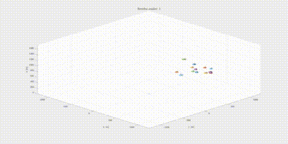

# Motion control and distributed localization of a parachute swarm

This repository contains the code Niccolo Andreetta and Simone Manfredi developed for the course "Intelligent Distributed System" project by Professor Fontanelli. The project consists of a simulation of n parachutes, dropped from a user-defined position in the air, aiming at the same target on the ground. Voronoi tessellation is implemented to avoid collisions, and two dynamics models are implemented:
- Linear model: consider the agents as drones fully actuated in x, y and z direction (although they are still subjected to gravity, so they can only break in vertical direction)
- Non-linear model: realistic parachute dynamics with forward velocity, angular velocity and breaks for the falling direction
Localization is performed through Kalman Filters and distributed WLS. GPS errors and relative measurements performed by the parachutes and actuators are considered.
Finally, the probability of getting the GPS signal and relative measurements are implemented to have a more realistic behaviour.

## How to run the code

The only file to be run is src/main.m.
A user interface prompt will appear asking to decide the initial position in space around which all the parachutes are deployed, the number of parachutes (for fast simulation, don't choose more than nine parachutes) and which model to implement.
Other more delicate parameters (such as covariance matrices of the errors and probabilities of GPS/relative measurements...) can be modified in the src/functions/parameters.m file.

## Other material

- In the folder "Figures", there are parametric analysis images and other valuable pictures taken from simulations
- The .mp4 file shows a complete simulation performed with 13 parachutes and all probabilities set to 1

